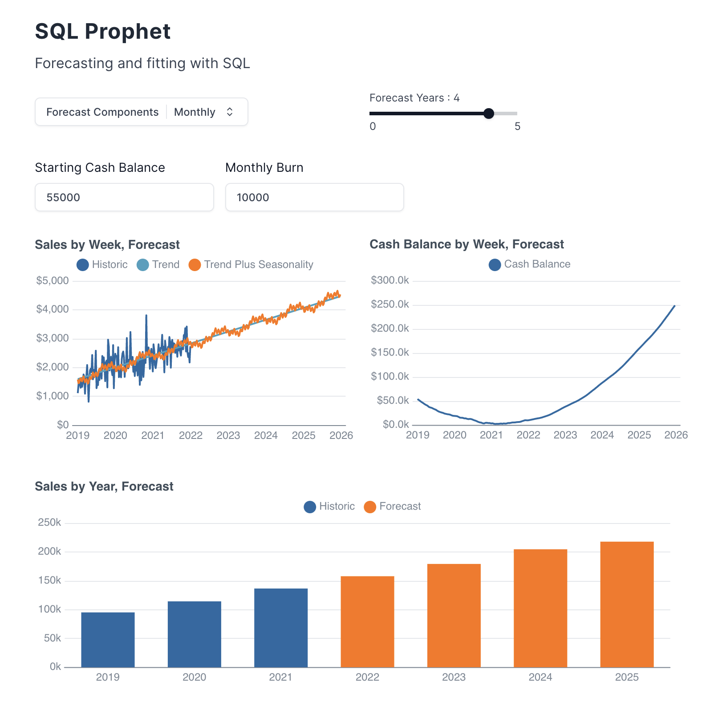

# SQL Prophet

Time series forecasting with DuckDB SQL and Evidence. [Live app &rarr;](https://sql-prophet.evidence.app/)




# Running

## Using Codespaces

Click the big green button that says `Code` and then Codespaces > Open Codespace

Once open, click the `Start Evidence` button in the bottom status bar.

## CLI

```bash
npx degit archiewood/sql-prophet sql-prophet
cd sql-prophet
npm install 
npm run sources
npm run dev 
```

## Requirements
- Node 18/20
- npm

## Learning More

- [Docs](https://docs.evidence.dev/)
- [Github](https://github.com/evidence-dev/evidence)
- [Slack Community](https://slack.evidence.dev/)
- [Evidence Home Page](https://www.evidence.dev)
